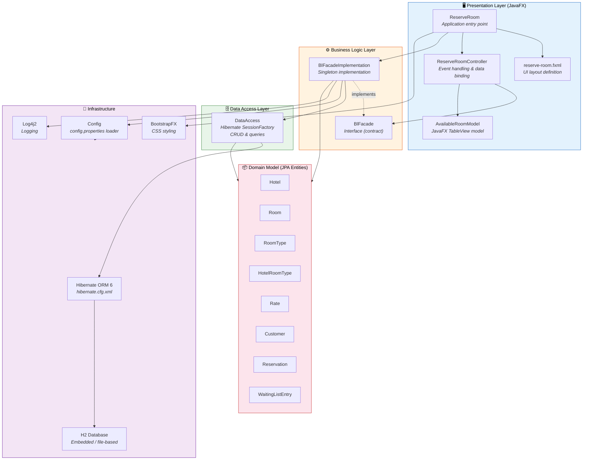
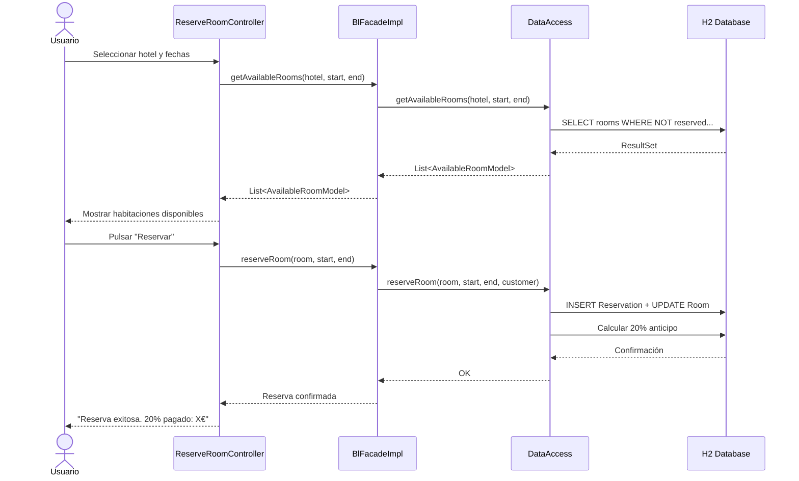

# Diagrama de Componentes — Hotel Reservation System

```mermaid
graph TB
    subgraph Presentation["🖥️ Presentation Layer (JavaFX)"]
        ReserveRoom["ReserveRoom<br/><i>Application entry point</i>"]
        FXML["reserve-room.fxml<br/><i>UI layout definition</i>"]
        Controller["ReserveRoomController<br/><i>Event handling & data binding</i>"]
        AvailableRoomModel["AvailableRoomModel<br/><i>JavaFX TableView model</i>"]
    end

    subgraph Business["⚙️ Business Logic Layer"]
        BlFacade["BlFacade<br/><i>Interface (contract)</i>"]
        BlFacadeImpl["BlFacadeImplementation<br/><i>Singleton implementation</i>"]
    end

    subgraph Data["🗄️ Data Access Layer"]
        DataAccess["DataAccess<br/><i>Hibernate SessionFactory<br/>CRUD & queries</i>"]
    end

    subgraph Domain["📦 Domain Model (JPA Entities)"]
        Hotel["Hotel"]
        Room["Room"]
        RoomType["RoomType"]
        HotelRoomType["HotelRoomType"]
        Rate["Rate"]
        Customer["Customer"]
        Reservation["Reservation"]
        WaitingListEntry["WaitingListEntry"]
    end

    subgraph Infrastructure["🔧 Infrastructure"]
        Config["Config<br/><i>config.properties loader</i>"]
        Hibernate["Hibernate ORM 6<br/><i>hibernate.cfg.xml</i>"]
        H2["H2 Database<br/><i>Embedded / file-based</i>"]
        Log4j["Log4j2<br/><i>Logging</i>"]
        BootstrapFX["BootstrapFX<br/><i>CSS styling</i>"]
    end

    ReserveRoom --> FXML
    ReserveRoom --> Controller
    ReserveRoom --> BlFacadeImpl
    Controller --> BlFacade
    Controller --> AvailableRoomModel
    BlFacadeImpl -.implements.-> BlFacade
    BlFacadeImpl --> DataAccess
    BlFacadeImpl --> Config
    BlFacadeImpl --> Log4j
    DataAccess --> Hibernate
    Hibernate --> H2
    Config --> Infrastructure
    ReserveRoom --> BootstrapFX

    DataAccess --> Domain
    BlFacadeImpl --> Domain

    style Presentation fill:#e3f2fd,stroke:#1565c0,color:#000
    style Business fill:#fff3e0,stroke:#e65100,color:#000
    style Data fill:#e8f5e9,stroke:#2e7d32,color:#000
    style Domain fill:#fce4ec,stroke:#c62828,color:#000
    style Infrastructure fill:#f3e5f5,stroke:#6a1b9a,color:#000
```

## Flujo de una reserva

```mermaid
sequenceDiagram
    actor User as Usuario
    participant UI as ReserveRoomController
    participant BL as BlFacadeImpl
    participant DA as DataAccess
    participant DB as H2 Database

    User->>UI: Seleccionar hotel y fechas
    UI->>BL: getAvailableRooms(hotel, start, end)
    BL->>DA: getAvailableRooms(hotel, start, end)
    DA->>DB: SELECT rooms WHERE NOT reserved...
    DB-->>DA: ResultSet
    DA-->>BL: List<AvailableRoomModel>
    BL-->>UI: List<AvailableRoomModel>
    UI-->>User: Mostrar habitaciones disponibles

    User->>UI: Pulsar "Reservar"
    UI->>BL: reserveRoom(room, start, end)
    BL->>DA: reserveRoom(room, start, end, customer)
    DA->>DB: INSERT Reservation + UPDATE Room
    DA->>DB: Calcular 20% anticipo
    DB-->>DA: Confirmación
    DA-->>BL: OK
    BL-->>UI: Reserva confirmada
    UI-->>User: "Reserva exitosa. 20% pagado: X€"
```
